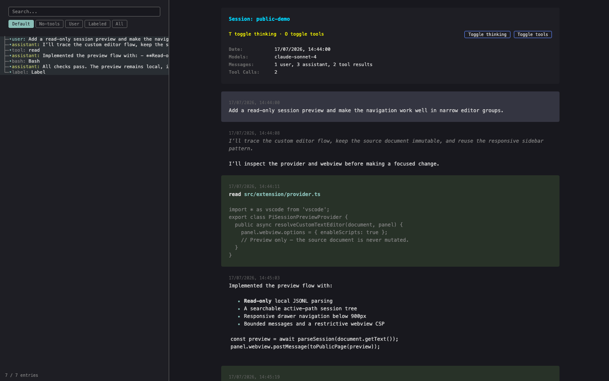

# Pi Session Preview

A read-only VS Code viewer for local [Pi](https://github.com/badlogic/pi-mono) session JSONL files. It shows the latest active conversation path without starting Pi, modifying files, or sending data anywhere.



<sub>Synthetic session data shown.</sub>

## Install

Requires desktop VS Code 1.127+.

```sh
git clone https://github.com/addorimprove/vs-pi-jsonl.git
cd vs-pi-jsonl
npm ci && npm run package:vsix
code --install-extension ./pi-session-preview.vsix
```

Or select **Extensions: Install from VSIX…** in VS Code.

## Use

1. Open a local `.jsonl` file.
2. Select **Open Pi Session Preview** or **Open With… → Pi Session Preview**.
3. Search or filter the session tree. Press <kbd>T</kbd> for thinking and <kbd>O</kbd> for tool output.
4. Select **Open JSONL Source** to return to the text editor.

Supports Pi v1–v3 sessions and pi-subagents child transcript logs, with live refresh, malformed-line recovery, bounded paging, and responsive navigation. JSONL remains a normal text editor by default.

## Scope

Local desktop files only. No writes, telemetry, network requests, workspace scans, active links/media, or Pi runtime dependency. This is a viewer—not a Pi client, editor, exporter, or full branch browser.

[Security](docs/pi-session-preview/SECURITY.md) · [Architecture](docs/pi-session-preview/ARCHITECTURE.md) · [Changelog](CHANGELOG.md) · [MIT License](LICENSE)
