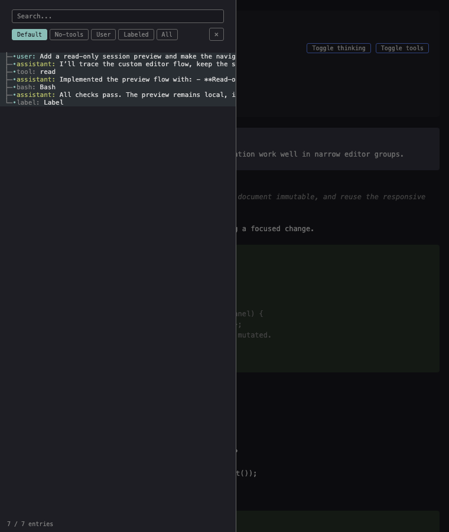

# Pi Session Preview

A fast, read-only VS Code viewer for local [Pi coding agent](https://github.com/badlogic/pi-mono) session files. Open a session JSONL beside your code and browse the current conversation path without starting Pi, changing the source file, or sending data anywhere.


<sub>Screenshots use synthetic session data.</sub>

## Highlights

- **Opt-in preview** — `.jsonl` files remain normal text documents unless you open the preview.
- **Pi session-aware** — parses Pi v1–v3 sessions, recovers around malformed lines, and displays the inferred latest active path.
- **Easy navigation** — search the session tree or filter it by Default, No-tools, User, Labeled, or All.
- **Readable transcripts** — view messages, thinking, tool calls and results, compaction, branch summaries, custom messages, metadata, and diagnostics.
- **Responsive UI** — resize the desktop sidebar or use it as a drawer in narrow editor groups.
- **Local and read-only** — no writes, telemetry, network requests, workspace scans, or Pi runtime dependency.

## Requirements

- Desktop VS Code **1.127 or newer**
- A local `file:` Pi session in JSONL format

Remote SSH, WSL, Dev Containers, VS Code Web, Cursor, VSCodium, and virtual/workspace-backed files are not currently supported or verified.

## Install from source

Packaged releases are not published yet. To build and install the extension locally:

```sh
git clone https://github.com/addorimprove/vs-code-pi-session-extension.git
cd vs-code-pi-session-extension
npm ci
npm run package:vsix
code --install-extension ./pi-session-preview.vsix
```

You can also run **Extensions: Install from VSIX…** in VS Code and select `pi-session-preview.vsix`.

## Use

1. Open a local `.jsonl` file normally.
2. Select **Open Pi Session Preview** in the editor title, run it from the Command Palette, or choose **Open With… → Pi Session Preview**.
3. Search or filter the session tree to navigate the active-path transcript.
4. Press <kbd>T</kbd> to toggle thinking and <kbd>O</kbd> to toggle tool output. The same controls are available in the preview header.
5. Select **Open JSONL Source** to return to the text editor in the same editor group.

The preview automatically loads earlier bounded pages into one continuous transcript and refreshes when the document changes. Unsaved text-document buffers are visible, but the extension never writes them back.

### Narrow editor groups

The session tree becomes an accessible drawer when the editor group is 900px wide or narrower.

<p align="center">
  
</p>

## Privacy and safety

Session files can contain prompts, source code, command output, local paths, and credentials. Pi Session Preview keeps that content local:

- It reads only the opened local file while its preview is alive.
- It does not edit, save, execute, upload, share, export, or start Pi.
- It includes no telemetry, analytics, remote assets, runtime CDN, or production dependencies.
- It treats every session string as untrusted text. Raw HTML, active links, images, `command:` URIs, ANSI/custom-tool HTML, and base64 media are inert or omitted.
- It uses a restrictive webview CSP, bounded messages, and DOM text-node rendering.

See [Security and privacy](docs/pi-session-preview/SECURITY.md) for the threat model and controls.

## Limitations

- This is a viewer, not a Pi client, session editor, full branch browser, exporter, or custom-tool host.
- The tree shows the normalized latest active path; inactive alternate branches are not available through the current protocol.
- Markdown support is intentionally limited to a safe subset. Raw HTML is displayed literally and URLs are not activated.
- Full syntax highlighting, active links/media, system prompts, tool catalogs, custom renderers, configurable limits, and persistent presentation state are deferred.

See the [Pi HTML-export parity notes](docs/pi-session-preview/PI-EXPORT-REFERENCE.md) for detailed behavior and divergences.

## Development

```sh
npm ci
npm run verify
npm run benchmark:large
npm run package:vsix
```

`npm run verify` runs lint, strict typechecking, unit and integration tests, VS Code Extension Development Host tests, packaging checks, and the production dependency audit.

Only synthetic fixtures belong in `src/test/fixtures/`. Never commit real Pi sessions, exports, generated VSIX files, or other transcript artifacts; `sessions/`, build output, benchmarks, and local subagent artifacts are ignored.

## Project documentation

- [Architecture](docs/pi-session-preview/ARCHITECTURE.md)
- [Requirements](docs/pi-session-preview/REQUIREMENTS.md)
- [Accessibility](docs/pi-session-preview/ACCESSIBILITY.md)
- [Release-candidate report](docs/pi-session-preview/evidence/final-report.md)
- [Changelog](CHANGELOG.md)
- [Third-party notices](THIRD-PARTY-NOTICES.md)

## License

[MIT](LICENSE). This project independently implements limited Pi persisted-format and export semantics and packages no Pi exporter code or vendor assets; see [Third-party notices](THIRD-PARTY-NOTICES.md).
